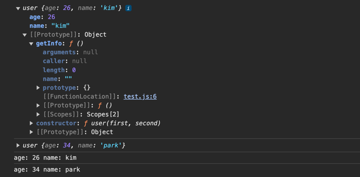

### 속성

```javascript
const kimInfo = {
    age: 26,
    name: 'kim',
    getInfo: function () {
        return `age: ${this.age} name: ${this.name}`
    }
}

console.log(kimInfo)
console.log(kimInfo.getInfo())   // age: 26 name: kim
```

age, name은 속성(property)라고 한다.   
이 속성 중에 getInfo 같이 함수가 할당되어 있으면 이것을 더 이상 속성이라 부르지 않고,  
method라고 부른다.  

참고로 이러한 속성과 method를 통틀어서 멤버(Member)라고도 부른다.  

this는 다음에 조금더 공부할 것인데, 현재 코드에서는 this가 소속되어 있는 객체 데이터(kimInfo)를 지칭한다.  
그래서 `this.age`을 `kimInfo.age`으로 작성해도 동일한 코드이다.  
다만, 이 kimInfo라는 변수명은 언제든지 바뀔 수 있으므로(객체 데이터가 다른 변수에 할당될 수도 있으므로)   
객체 이름을 직접적으로 명시하는 것 보다는 this를 통해 그 객체를 지칭하는 것이 규칙이다.  

---

### 생성자 함수

```javascript
const kimInfo = {
    age: 26,
    name: 'kim',
    getInfo: function () {
        return `${this.age} ${this.name}`
    }
}

console.log(kimInfo)
console.log(kimInfo.getInfo())   // age: 26 name: kim

const parkInfo = {
    age: 34,
    name: 'park',
    getInfo: function () {
        return `age: ${this.age} name: ${this.name}`
    }
}
console.log(parkInfo.getInfo)    

const leeInfo = {
    age: 50,
    name: 'lee',
    getInfo: function () {
        return `age: ${this.age} name: ${this.name}`
    }
}
console.log(leeInfo.getInfo)
```

만약 여러 사람 정보를 저장하려면,  
이렇게 동일한 구조를 가진 객체들을 하나씩 만들어줘야 한다.  
이러한 방색은 매우 효율이 떨어진다. 특히 객체의 중괄호 안에 값(age, name, getInfo)은 하나씩 메모리에 할당이 된다.  
age, name은 그래야하지만, getInfo은 동일한 함수인데 3개의 객체를 만들고 3개의 getInfo을 만드는 것은 매우 비효율적이다.  

이러한 방식을 해결해줄 수 있는 개념이 class 개념이다.  
다만, JS의 클래스는 일반적인 프로그래밍 언어에서 부르는 클래스와는 조금 차이가 있지만, 우선 이런 부분은 생각하지 않고 진행하겠다.  

그래서 공통된 부분을 아래처럼 묶어줄 수 있다.  

```javascript
function user(first, second) {
    this.age = first
    this.name = second
    this.getInfo = function () {
        return `age: ${this.age} name: ${this.name}`
    }
}

const kimInfo = new user(26, 'kim')
// 이러면 첫 번째 파라미터 26를 first 인자에, 
// 두 번째 파라미터 'kim'를 second 인자에 전달하고, 
// 이렇게 정의한 내용을 kimInfo에 할당한다. 
const parkInfo = new user(34, 'park')

console.log(kimInfo);    
// 이 객체의 속성으로는 age, name이 들어가 있고, 
// 각각에 값으로 우리가 대입한 값이 들어가 있다.
console.log(parkInfo);
```
이렇게 new 라는 키워드를 통해 user라는 함수를 실행하게 되었고,  
이렇게 실행한 user라는 함수를 생성자 함수라고 부른다.  
쉽게는 객체 데이터를 생성하니까 생성자 함수라고 생각하자.  

```javascript
const kimInfo = new user(26, 'kim')
const parkInfo = new user(34, 'park')
```
위에 생성자 함수는 아래와 같이 할당했다고 생각하자.(맨 처음 봤던 코드)
```javascript
const kimInfo = {
    age: 26,
    name: 'kim',
    getInfo: function () {
        return `age: ${this.age} name: ${this.name}`
    }
}
const parkInfo = {
    age: 34,
    name: 'park',
    getInfo: function () {
        return `age: ${this.age} name: ${this.name}`
    }
}
```

<br/>

---

### 인스턴스

```javascript
const kimInfo = new user(26, 'kim')
const parkInfo = new user(34, 'park')
```

**생성자 함수를 통해 생성된 각각의 변수(kimInfo, parkInfo)는 인스턴스(instance)라고 부른다!!**


위 코드처럼 생성자 함수를 사용하면 반복적인 코드는 줄일 수 있지만,  
여전히 getInfo은 각각의 객체(kimInfo, parkInfo)에 생성되기에 메모리적 측면에서는 비효율적이다.  

```javascript
function user(first, second) {
    this.age = first
    this.name = second
}

user.prototype.getInfo = function () {
    return `age: ${this.age} name: ${this.name}`
}

const kimInfo = new user(26, 'kim')
const parkInfo = new user(34, 'park')

console.log(kimInfo);
console.log(parkInfo);
console.log(kimInfo.getInfo());    
console.log(parkInfo.getInfo());
```

이렇게 코드를 수정하면 하나의 함수를 활용할 수 있다.  

---

### 프로토타입



`__proto__` 객체 데이터가 있고 그 하위에 getInfo 함수가 있다.  
이렇게 공통 공간에 함수를 저장했다고 우선 생각하자.  

prototype 개념이 사용된것인데,  
age과 name은 그때그때 user라는 생성자 함수가 실행될 때마다 다른 내용이 들어올 수 있기에 각각 메모리를 할당하지만,  
getInfo은 로직이 동일하기에 통일화해서 메모리를 관리할 수 있다.  
그래서 user 함수에 숨어져 있는 prototype이라는 속성에다가 getInfo을 할당해준 것이다.  
그러면 kimInfo, parkInfo 등 다양한 객체를 new user를 통해서 만들어도 오직 하나의 getInfo만 만들어지는 것이다.  
각각의 객체(인스턴스)는 한 번만 만들어진 getInfo함수를 연결(참조)하는 것이다.  

사실 자바스크립트는 굉장히 많은 부분에서 prototype 개념을 사용하고 있다.  
그래서 자바스크립트를 prototype 기반의 프로그래밍 언어라고도 부른다.  

```javascript
const a = [1, 2, 3]
console.log(a);
```
이 배열을 출력해서 안쪽을 열어보면,  
내부에 prototype이라는 객체가 들어있다.(`__proto__`)  
이 객체에 우리가 이전에 사용했던 많은 함수들이 들어가 있다.   
만약 이러한 프로토타입 개념이 없었더라면, 배열을 많들때마다 이 수많은 함수들을 각각의 배열을 생성할때마다 생성해야 했겠지만,  
이 프로토타입 개념 덕분에 하나의 함수를 만들어서 각각의 배열 객체들이 참조(연결)만 하면 사용 가능한 것이다.  

---

### 생성자 함수 컨벤션
```javascript
function user(first, second) {
    this.age = first
    this.name = second
}

const kimInfo = new user(26, 'kim')
```
위에 예제에서는 이렇게 작성했지만,  
실제 코드는 아래처럼 작성해야 한다. 

```javascript
function User(age, name) {
    this.age = age
    this.name = name
}

const kimInfo = new User(26, 26)
```
이처럼 생성자 함수는 일반 함수와 구분하기 위해 대문자로 시작해야한다.(카멜 케이스가 아니라 파스칼 케이스로 작성 -> 이 케이스는 맨 처음 수업에 했었다.)    

근데 이러한 코드는 이전에 많이 봤었는데

```javascript
const arr = new Array(10);
```
이렇게 배열을 생성할때 자주 사용했었다.  
그말인 즉 배열 또한 객체이며 생성자 함수로 생성된다는 뜻이다.  