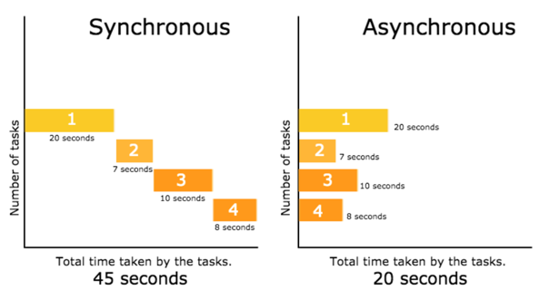
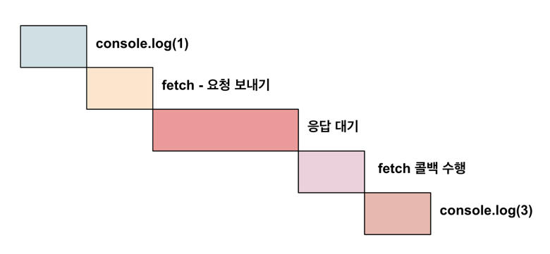
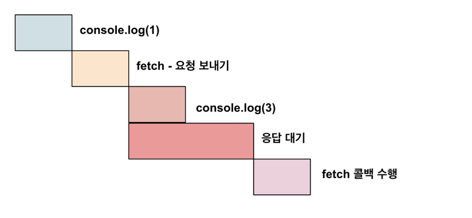

# 동기
동기 실행은 우리에게 익숙한 방식이다.  
작업을 다 처리하고 나서야 다음 코드로 넘어가는 방식이다.  
예를 들어,
```javascript
console.log(1)
console.log(2)
console.log(3)
```
이 코드는 당연히 1, 2, 3 순으로 출력된다.  
이처럼 순서대로 코드가 실행되고, 실행된 코드가 완려되야 다음 코드로 넘어가는 방식을 말한다.  
즉, 코드가 보이는 순서대로 실행되는 것이다.

```javascript
console.log(1)

fetch('https://koreanjson.com/users/1')
  .then((response) => response.json())
  .then((result) => { console.log(result) })

console.log(3)
```
그렇다면 이 코드는 어떨까?  

이 코드의 실행 결과는 다음과 같다.
```
1
3
{
  id: 1,
  name: '이정도',
  ...
  createdAt: '2019-02-24T16:17:47.000Z',
  updatedAt: '2019-02-24T16:17:47.000Z'
}
```
왜 순차적으로 실행되지 않았는지는 비동기 실행을 이해하면 알 수 있다.

# 비동기

### 예
동기를 실생활의 예로 들면,  
식당에서 직원이 한 명뿐인 경우를 생각해 볼 수 있다.  
직원 한 명이서 주문을 받고(console.log(1)) 주문이 끝나면 요리를 진행한다.(console.log(2))  
요리가 끝나면 음식을 서빙한다.(console.log(3))  
현재까지는 문제가 없어 보인다. 근데 요리 하는 중에 다른 손님이 들어오면 어떻게 해야할까?  
직원이 한 명뿐이여서 요리가 끝나고 음식 서빙을 완료해야만, 다른 손님의 주문을 받을 수 있을 것이다.  

그렇다면 비동기는 어떨까?  
비동기의 예로는 홀에 직원 한명, 주방에 직원 한 명이 있다고 생각해볼 수 있다.  
홀 직원이 주문을 받고(console.log(1)) 이 주문이 끝나면 주방 직원이 요리를 시작한다.(fetch())  
홀 직원은 다른 손님의 주문을 또 받을 수 있다.(console.log(3))  
그리고 요리가 완성되면 그 음식을 서빙하는 것이다.(fetch 함수의 console.log(result))



### 코드
```javascript
console.log(1)

fetch('https://koreanjson.com/users/1')
  .then((response) => response.json())
  .then((result) => { console.log(result) })

console.log(3)
```
이 코드를 더 구체적으로 봐보자.  
이 코드에는 현재 2개의 콜백이 있다.  
1. `(response) => response.json()`
2. `(result) => { console.log(result) }`

fetch함수가 요청(request)를 보내고, 서버(koreanjson)에서 응답(response)를 받으면 이 콜백들이 순서대로 실행된다.  

우선 이 코드가 동기적으로 실행된다고 가정하고 봐보자.  
1. `console.log(1);`
2. fetch() 요청 전송
3. 응답이 오면 콜백 함수 2개 수행
4. `console.log(3)`

이렇게 모든 작업이 완료되면 다음 줄의 코드가 수행될 것이다.  

하지만 fetch 함수는 비동기 함수이다.  
비동기 함수 내부의 코드는 비동기적으로 수행된다.  
1. `console.log(1);`
2. fetch() 요청 전송
3. 응답이 올 때까지 대기
4. `console.log(3)`
5. 응답이 오면 콜백 함수 2개 수행

이처럼 fetch함수가 완료되기 전이라도 다음 줄의 코드(`console.log(3)`)를 실행한다.  
그리고 fetch함수의 응답이 완료되면 내부의 콜백 함수를 수행한다.  

일반적으로 네트워크에 요청을 보내고 응답을 받는 작업은 시간이 걸리는 작업이다.  
즉, 요리하는 작업이라고 생각하면 된다.  
요리를 하는 동안 다른 모든 작업(다른 손님 주문 받기 등)을 멈추는 방식보다는  
요리를 하는 동시에 다른 작업을 수행하는 방식이 더 효율적이다.  

- 동기 실행
  

- 비동기 실행


이처럼 비동기 실행이 최종 작업 종료 시간이 더 짧다.  
(다만, 실제로는 비동기 실행의 경우 콜백을 등록하는 시간적 비용 등이 추가로 존재하지만 이러한 부분은 생략하고 생각하자)

---

# 비동기 함수
## setTimeout
우리가 종종 봤던 setTimout 함수도 사실은 비동기 함수였다.  

```javascript
console.log(1)

setTimeout(() => { console.log(2) }, 3000)

console.log(3)
```
이 코드를 실행하면 1, 3이 먼저 출력되고 3초후 2가 출력된다.  

## setInterval
setInterval함수는 setTimeout과 유사한데, 2번째 파라미터로 받은 시간을 간격으로 계속 실행되는 함수이다.

```javascript
console.log(1)

setInterval(() => { console.log(2) }, 3000)

console.log(3)
```

# Promise 객체의 등장
비동기 함수를 살펴봤는데, fetch 함수와는 다른 형태이다.  

```javascript
setTimeout(콜백, 시간)
setInterval(콜백, 시간)
```
이처럼 함수의 argumet로 콜백을 바로 넣는다.  
하지만 fetch 함수는 다른 형태였었다.

```javascript
fetch('https://koreanjson.com/users/1')
  .then((response) => response.json())
  .then((result) => { console.log(result) })
```
콜백을 파라미터로 바로 넣는게 아니라, fetch 함수가 리턴하는 객체(Promise)에 then 메소드를 사용해 콜백을 등록했다.

왜 fetch만 사용하는 형식이 다를까?  
만약 setTimout(), setInterval()과 동일한 형식으로 fetch함수를 구현하면 어떨까?  

```javascript
fetch(url, callback)
```
이렇게 사용할 수 있을 것이다.  

만약 이러한 방식처럼 함수에 콜백을 직접 넣는 방식이 채택되었다면 여러 콜백을 수행할때 아래와 같은 코드가 작성될 것이다.  
```javascript
fetch('https://first.com', (response) => {
  // Do Something
  fetch('https://second.com', (response) => {
    // Do Something
    fetch('https;//third.com', (response) => {
      // Do Something
      fetch('https;//fourth.com', (response) => {
        // Do Something
      })
    })
  })
})
```
fetch() 안의 콜백에 fetch 함수가 있고, 그 함수의 콜백안에 fetch 함수가 있고 이런 식으로 반복되는 형식은 콜백 헬(callback hell)이라고 한다.  
이러한 콜백 헬의 가장 큰 문제는 가독성이 떨어진다.  

그래서 Promise객체와 then 메소드를 사용한 방식이 채택된 것이다.
```javascript
fetch('https://first.com')
  .then((response) => {
    // Do Something 
    return fetch('https://second.com');
  })
  .then((response) => {
    // Do Something 
    return fetch('https://third.com');
  })
  .then((response) => { 
    // Do Something 
    return fetch('https://third.com');
  });
```
이러면 각각의 로직(Do Something)을 좀 더 보기 쉽게 확인할 수 있다.  


