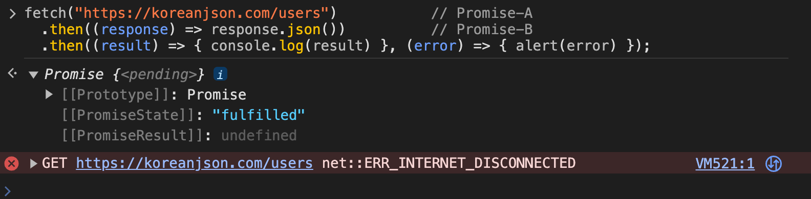

# then

```javascript
const successCallback = function () { };
const errorCallback = function () { };

fetch("https://koreanjson.com/users")     // Promise-A 
  .then(successCallback, errorCallback);  // Promise-B
```

이 코드는 fetch 함수의 작업이 성공하는 경우와 실패하는 경우로 나누어서 동작한다.

1. fetch 함수의 작업이 성공해 Promise-A 객체가 **fulfilled 상태**가 된 경우 : then 메소드 안의 "첫 번째" 콜백인 **successCallback**이 실행
2. fetch 함수의 작업이 실패해 Promise-A 객체가 **rejected 상태**가 된 경우 : then 메소드 안의 "두 번째" 콜백인 **errorCallback**이 실행

여기서 중요한 점은 **Promise-B는, 실행된 successCallback 또는 errorCallback에서 무엇을 반환하느냐**에 따라   
그**상태**(fulfilled or rejected)와  
**결과**(작업 성공 결과 or 작업 실패 정보)가 결정된다는 점이다.

이처럼 **then 메소드가 반환한 Promise 객체가, 콜백이 반환하는 값에 따라 어떻게 달라지는지** 경우를 다음 경우들로 나눠서 구체적으로 보겠다.  

- 실행된 콜백이 Promise 객체를 반환하는 경우
- 실행된 콜백이 Promise 객체 이외의 값을 반환하는 경우
- 실행된 콜백이 아무 값도 반환하지 않는 경우
- 실행된 콜백 내부에서 에러가 발생하는 경우
- 아무런 콜백도 실행되지 않는 경우

## 실행된 콜백이 Promise 객체를 반환하는 경우
```javascript
fetch("https://koreanjson.com/users")           // Promise-A 
  .then((response) => response.json())          // Promise-B
  .then((result) => { console.log(result) });   // Promise-C
```


앞에서 다뤘던 것처럼 `json()`메소드는 Promise 객체를 반환한다.  
그래서 `(response) => response.json()` 이 콜백은 Promise 객체를 반환한다.  

이처럼 콜백에서 Promise 객체를 반환하는 경우에는  
그 콜백을 등록한 then 메소드가 반환한 Promise 객체(Promise-B)의 상태와 결과는  
then() 메서드가 반환한(`response.json()`)의 상태와 결과를 동일하게 갖게 된다.  

간단히 말하면,  
Promise-B는 `(response) => response.json()`의 상태와 결과를 갖게 되는 것이다.  

즉, 콜백에서 반환하는 Promise 객체를 then 메소드가 그대로 반환한다.
이 이후 부터는 콜백에서 반환한 Promise 객체로부터 다시 Promise Chain이 이어져 나간다고 보면 된다.  
`(response) => response.json()`

## 실행된 콜백이 Promise 객체 이외의 값을 반환하는 경우
콜백이 Promise 객체만을 반환하는 것은 아니다.  

```javascript
// 인터넷 연결 해제 후 테스트

fetch("https://koreanjson.com/users")                         // A 
  .then((response) => response.json(), (error) => "error!")   // B
  .then((result) => { console.log(result) });                 // C
```


이 코드의 경우 인터넷 연결을 해제한 후 테스트 해보면, fetch() 함수가 실패해,  
then() 메서드(B)의 두 번째 콜백인 `(error) => "error!"`이 실행된다.  
이 두 번째 콜백은 "error!"라는 문자열을 반환한다.  
이처럼, Promise 객체가 아닌 문자열, 숫자, 객체 등을 반환할 수도 있다.  

이렇게 Promise 객체 이외의 값을 반환한 경우에는,  
B의 then() 메소드는 fulfilled 상태이고, 작업의 성공 결과로 "error!" 문자열을 가진 Promise를 반환한다.  
그래서 result에는 해당 Promise 객체를 받고, error! 를 출력하게 된다.

## 실행된 콜백이 아무 값도 반환하지 않는 경우

```javascript
// 인터넷 연결 해제 후 테스트

fetch("https://koreanjson.com/users")                                   // A 
  .then((response) => response.json(), (error) => { alert("error!") })  // B
  .then((result) => { console.log(result) });                           // C
```


직전에 봤던 예시 코드와 유사하지만, alert를 사용해 반환하는(return하는) 값 없이 끝나는 경우를 보자.  

자바스크립트에서는 함수가 아무것도 반환하지 않으면 **undefined를 반환한 것으로 간주한다.**  
따라서 B에서 then() 메서드에서 반환하는 **Promise 객체는 fulfilled 상태이고 작업의 성공 결과로는 undefined를 갖게 된다.**  

## 실행된 콜백 내부에서 에러가 발생하는 경우
```javascript
fetch("https://koreanjson.com/users") 
  .then((response) => { throw new Error("error") });
```


이렇게 에러가 발생되는 경우 **Promise 객체는 rejected 상태가 되고, 작업 실패 정보로 해당 에러 객체를 갖게 된다.**  

## 아무런 콜백도 실행되지 않는 경우
```javascript
// 인터넷 연결 해제 후 테스트

fetch("https://koreanjson.com/users")           // Promise-A 
  .then((response) => response.json())          // Promise-B
  .then((result) => { console.log(result) }, (error) => { alert(error) });
```



then 메소드의 아무런 콜백도 실행되지 않는 경우가 있다.  
위에 코드를 실행해보면, fetch함수가 반환한 Promise-A 객체는 rejected 상태이기 때문에,  
첫 번째 then 메소드의 두 번째 콜백이 실행되어야 한다.  
하지만 현재 코드에는 두 번째 콜백이 없다.  
이런 경우에는 아무런 콜백도 실행되지 않는다.    

이러한 경우에는,  
**Promise-B 객체는 이전 Promise 객체(Promise-A)와 동일한 상태와 결과를 갖는다.**  
즉, Promise-B 객체는 Promise-A 객체처럼 rejected 상태과 되고 똑같이 작업 실패 정보를 갖게 된다.  

rejected 상태가 된 Promise-B의 then 메소드에는 두 번째 콜백(`(error) => {}`)가 존재하기에 이 콜백이 실행된다.  
