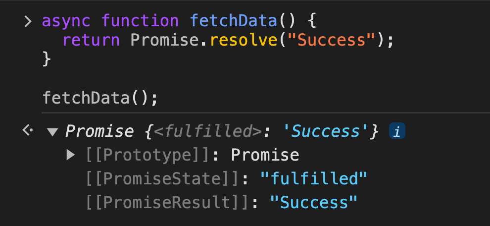
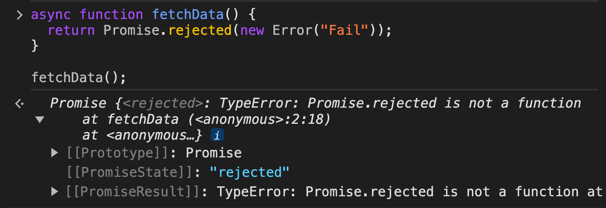
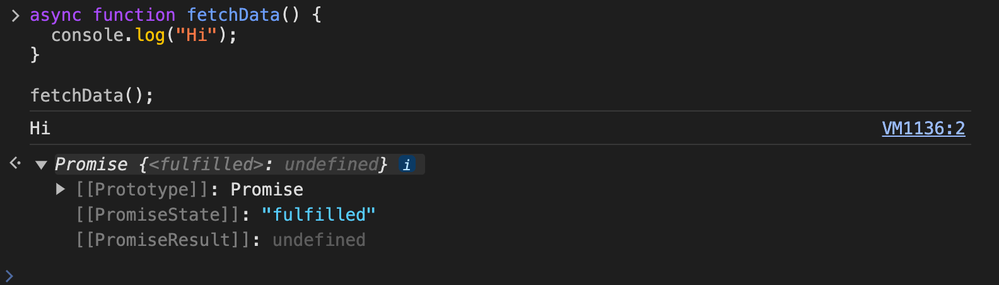
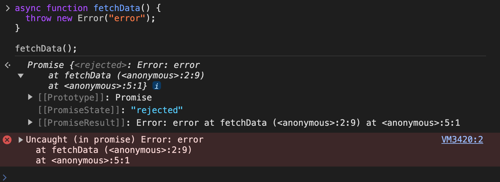

# async/await
## async 
`async` 함수는 함수 선언 앞에 `async` 키워드를 붙여 정의한다.  
이 키워드는 함수가 비동기적으로 동작함을 나타낸다.  

```javascript
async function fetchData() {
  // 비동기 작업을 수행하는 코드
}
```

## await 
`await`는 `async` 함수 내에서만 사용 가능한 키워드이다.  
`await` 키워드는 다음에 비동기 작업을 수행하는 함수 또는 Promise 객체가 온다.  
`await`는 해당 작업이 완료될 때까지 실행을 일시 중지하고, 그 결과를 기다린 후에 다음 코드를 실행한다.  

```javascript
async function fetchData() {
  const response = await fetch("https://koreanjson.com/users");
  const data = await response.json();
  return data;
}
```
이 코드에서 `await fetch("https://koreanjson.com/users")`는 웹에서 데이터를 가져오눈 비동기 작업을 수행하고, 그 결과가 도착할 때까지 실행을 일시 중지한다.  

## 비동기 실행 코드  

```javascript
/*
fetch("https://koreanjson.com/users")        
  .then((response) => response.json())       
  .then((result) => { console.log(result) });
*/

async function fetchData() {
  console.log(2);
  const response = await fetch("https://koreanjson.com/users");
  console.log(7);
  const result = await response.json();
  console.log(result);
}

console.log(1);
fetchData();
console.log(3);
console.log(4);
console.log(5);
console.log(6);
```

이 코드는 위에 주석처리한 fetch 함수와 동일한 함수이다.  

다만, fetchData() 함수는 비동기 실행 함수보다는 일반적인 동기 실행 함수처럼 생겼다.  
그래서 코드의 가독성을 높일 수 있다.  
이러한 점이 async/await 를 사용하는 이유이다.   

하지만, 앞서 언급했듯 이 코드는 비동기 실행 코드이다! 

위에 코드를 보고 동기 방식대로 동작한다고 예상하면 아래와 같은 결과가 출력될 것이다.
```
1
2
7
[리스폰스의 내용]
3
4
5
6
```

하지만 이 코드는 async/await를 사용한 비동기 실행 코드이므로 실제 출력 결과는 아래와 같다.  

```
1
2
3
4
5
6
7
[리스폰스의 내용]
```

만약 위 코드가 이해되지 않는다면, 아래 코드와 같다고 생각해보자.  

```javascript
function fetchData() {  
  console.log(2);
  fetch("https://koreanjson.com/users")
    .then((response) => {
      console.log(7);
      return response.json();
    })
    .then((result) => { console.log(result); });
}

console.log(1);
fetchData();
console.log(3);
console.log(4);
console.log(5);
console.log(6);
```

**꼭 기억해야하는 점은 async/await 구문 속에는 Promise 객체가 존재한다는 점이다.**
```javascript
async function fetchData() {
  console.log(2);
  const response = await fetch("https://koreanjson.com/users");
  console.log(7);
  const result = await response.json();
  console.log(result);
}

console.log(1);
fetchData();
console.log(3);
console.log(4);
console.log(5);
console.log(6);
```

async 함수 안의 코드가 실행되다 await를 만나면,  
일단 await 뒤의 코드가 실행되고, 코드의 실행 흐름이 async함수 바깥으로 나가서 나머지 코드를 다 실행한다.(3부터 6까지 출력)  
이후로는 await 뒤에 있던 Promise 객체가 fulfilled 상태가 되기를 기다린다.(`fetch()`)  
그리고 기다리던 Promise 객체가 fulfilled 상태가 되면 await가 Promise 객체의 작업 성공 결과를 반환하는 것이다.  
그리고 이후 코드가 진행된다.  

## 예외

만일 await 뒤 Promise 객체가 rejected 상태가 된 경우에는 아래처럼 예외 구문을 사용할 수 있다.  

```javascript
async function fetchData() {
  try {
    const response = await fetch("https://koreanjson.com/users");
    const result = await response.json();
    console.log(result);
  } catch (error) {
    console.log(error);
  } finally {
    console.log("exit");
  }
}

fetchData();
```

이 코드처럼 fetch 함수에서 URL에 오류가 있는 경우 catch 블록이 실행되고 오류 메시지가 출력된다.  
그리고 앞에서 다뤘던 것처럼 예외 발생 여부와 관계 없이 finally 블록은 항상 실행된다.  

## async 함수가 반환하는 Promise 객체

async 함수는 반환하는 값에 따라 그에 맞는 Promise 객체를 반환한다.  
이때 적용되는 규칙은 then 함수가 반환하는 값에 따라 Promise 객체를 반환했던 규칙들과 유사하다.  

### Promise 객체를 반환하는 경우

async 함수 안에서 Promise 객체를 반환하는 경우에는  
**해당 Promise 객체와 동일한 상태와 적업 성공 결과(또는 작업 실패 정보)를 가진 Promise 객체를 반환한다.**  
즉, 해당 Promise 객체를 반환하는 것이다.  

```javascript
async function fetchData() {
  return Promise.resolve("Success");
}

fetchData();
```



```javascript
async function fetchData() {
  return Promise.rejected(new Error("Fail"));
}

fetchData();
```



이처럼 fulfilled 상태인 Promise 객체와 rejected 상태인 Promise 객체를 리턴하는 모든 경우가 해당된다.  

### Promise 객체 이외의 값을 반환하는 경우

async 함수 내부에서 Promise 객체 이외에 숫자나 문자열, 일반 객체 등을 반환하는 경우에는, **fulfilled 상태이면서, 반환된 값을 작업 성공 결과로 가진 Promise 객체**를 반환한다.  

```javascript
async function returnNumber() {
  return 3;
}

async function returnString() {
  return "Hi";
}

async function returnObject() {
  const info = {
    name: "kim",
    email: "kim@naver.com",
  };

  return info;
}

returnNumber();
returnString();
returnObject();
```

### 아무 값도 반환하지 않는 경우
```javascript
async function fetchData() {  
  console.log("Hi");
}

fetchData();
```



앞에서도 언급했지만, 이처럼 아무값도 반환하지 않는 경우 자바스크립트는 undefined를 반환한 것으로 간주한다고 했다.  
따라서 위 코드는 fulfilled 상태이면서, undefined를 작업 성공 결과로 가진 Promise 객체가 반환된다.  

### async 함수 내부에서 에러가 발생했을 때

```javascript
async function fetchData() {  
  throw new Error("error");
}

fetchData();
```



async 함수 안에서 에러가 발생하면, **rejected 상태이면서, 해당 에러 객체를 작업 실패 정보로 가진 Promise 객체**가 반환된다.  

## 함수에 표현에 따른 async를 붙이는 위치

이전에 다뤘듯이 자바스크립트에서 함수를 표현하는 다양한 방법이 있다.  

이 각긱의 경우에 async 키워드를 어떻게 붙이는지 보겠다.

```javascript
async function example1(a, b) {
  return a + b;
}

const example2 = async function add(a, b) {
  return a + b;
};

const example3 = async function(a, b) {
  return a + b;
};

const example4 = async (a, b) => {
  return a + b;
};

const example5 = async (a, b) => a + b;
```
