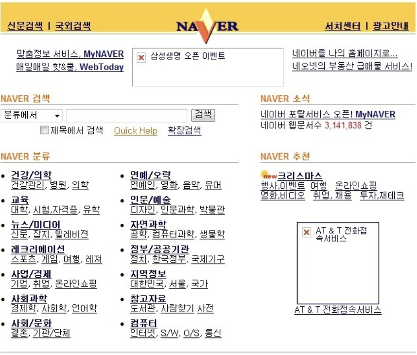
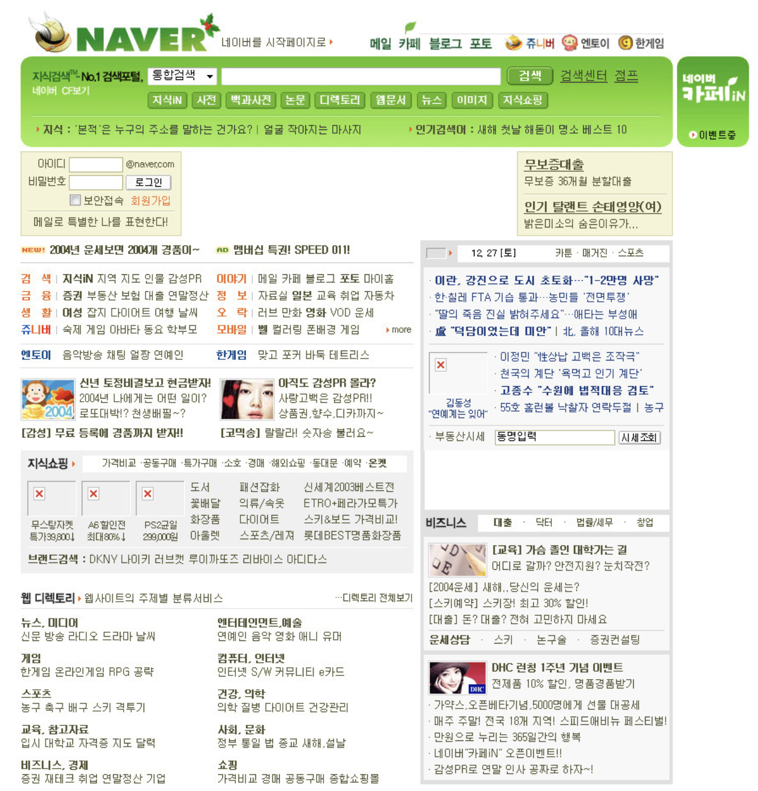
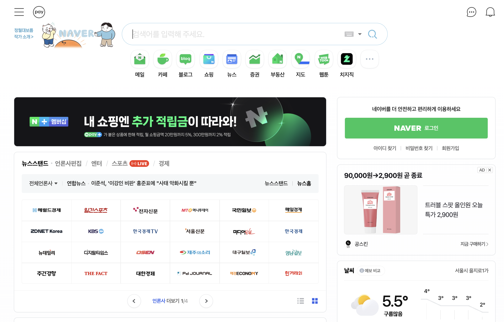
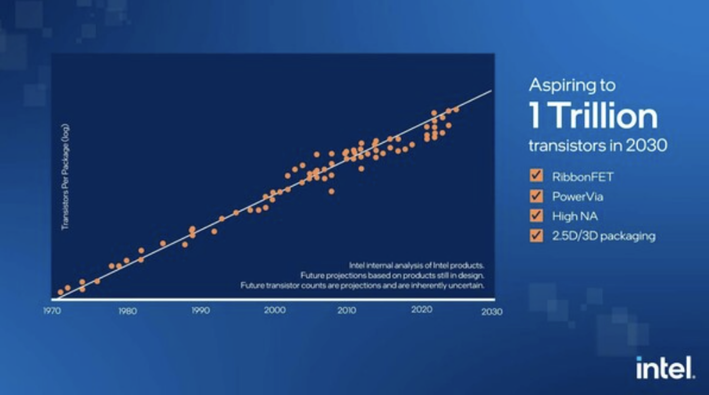
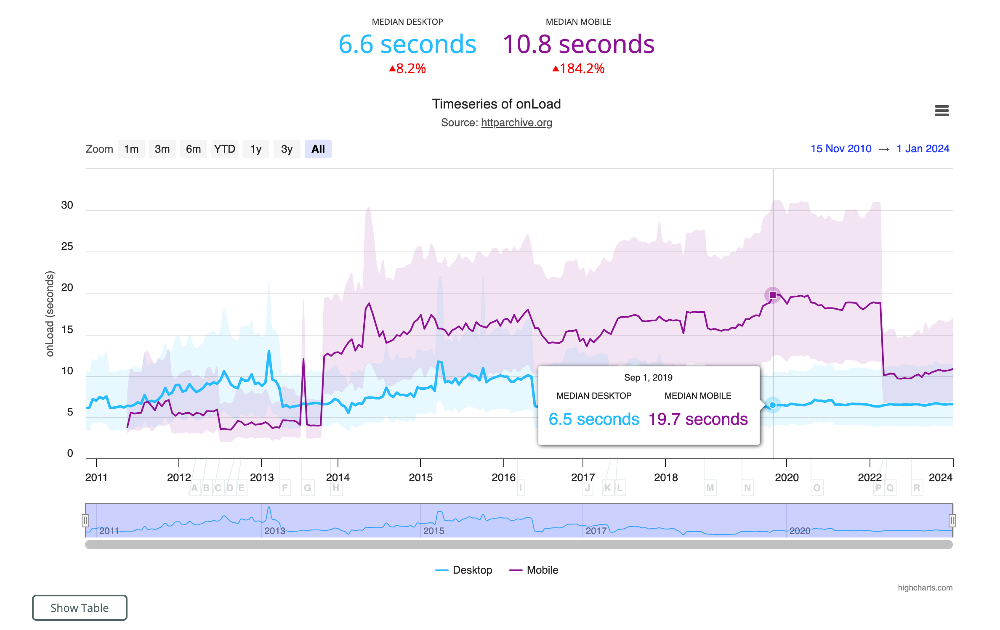

1997년 네이버가 서비스를 시작했을 당시 모습

2004년 네이버의 메인 화면

현재 네이버 메인 화면

이렇게 보이는 UI만 달라진 것은 아니다.  

[네이버 SSR 도입](https://d2.naver.com/helloworld/7804182)

네이버 블로그 서비스의 경우에도  

전통적인 서버 사이드에서 동작하던 방식을   
2016년 angular.js를 도입해 SPA로 구축하였고,  
이후에는 Node.js 기반의 SSR을 도입했다고 한다.  

이러한 전반적인 웹 애플리케이션의 변화 과정을 살펴보려고 한다.  

## LAMP
Linux, Apache, MySQL, PHP 또는 Python으로 구성된 기술 스택이 과거에는 매우 인기 있는 웹 개발 구조 였다.  

네이버도 처음에도 php로 구현되었었다는 이야기를 들었고,  
관련 자료를 찾아보려 했는데 아쉽게 찾지는 못했다.  

다만, 
https://www.naver.com/index.php  
이 주소를 찾아볼 수는 있었다.  
이러한 url 형식은 php로 코드를 작성할때 사용되는 형식이기는 하다.  

당시에는 자바스크립트의 역할이 제한적이였기에 대부분의 처리를 서버에서 해야했기에 대중적이였던 방식이었다.  

다만, 서버에 의존적인 방식은 웹 애플리케이션 기능이 다양해지거나 사용자가 늘어나면 서버도 확장해야 했지만,   
그 당시에는 클라우드 개념도 없었고, 도커에 대한 개념도 없어서 당시에 서버를 확장하는 것은 매우 번거로운 일이었다.  

---

##### 참고) Snowflakes 패턴 & Phoenix 패턴

그 당시 서버 이야기를 간단하게만 하자면,  
그 당시에 서버 패턴 방식은 Snowflakes 패턴 방식이었다.
이름처럼 눈송이를 굴리듯이 기존에 서버를 계속해서 패치하거나 설정을 추가하는 방식으로 애플리케이션의 확장을 다뤘다.  
이 방식의 문제 서버가 잘못되어서 날라가면 다시 이 방식대로 복원하기가 매우 어렵다는 점이었다.  
그러니 LAMP 방식으로 계속 서버를 확장하는 방식은 매우 까다롭고 위험도도 높은 번거로운 작업이었다.  

여담으로 지금은 클라우드 서버와 도커와 같은 컨테이너의 등작으로 Phoenix Server 패턴 방식이 대중화가 되었다.  
phoenix 패턴은 불사조처럼 불속에서 다시 태어나는 모습을 생각하면 된다.  
도커를 예로 들면 도커 파일에 작성해 놓은 서버 설정 작업만 있으면 새로운 클라우드 컴퓨터에서 도커만 실행하면 동일한 서버가 생성되기 때문이다.  

--- 

LAMP는 서버를 확장하는 문제만 있는 것이 아니다.  

LAMP 방식 구현 사이트들  

이러한 서버 사이드에서 작동하는 방식은 페이지를 전환할 때마다 새롭게 페이지를 요청하고, HTML 페이지를 다운로드해 파싱하는 작업을 거친다.  
이렇게 페이지를 처음부터 새로 그려야 하기에 페이지가 전환될때 부자연스러운 모습을 보인다.  

이 사이트만 경험하면 부자연스럽다고 못느낄 수도 있다.  
하지만 SPA의 정석인 Gmail을 사용하면 얼마나 부드러운 화면 전환이 가능한지 볼 수 있다.  

## Single Page Application 

이러한 문제들을 극복하고자 등장한게 SPA이다.
싱글 페이지 애플리케이션이란 렌더링과 라우팅에 필요한 대부분의 기능을 서버가 아닌 브라우저의 자바스크립트에 의존하는 방식을 의미한다.
첫 페이지에서 모든 데이터를 불러오는 방식이다.  
그래서 페이지를 불러온 이후에는 서버에서 HTML을 내려받지 않고 하나의 페이지에서 모든 작업을 처리하므로 싱글 페이지 애플리케이션이라고 한다.  

장점 : 한번 로딩된 이후에는 서버를 거쳐 필요한 리소스를 받아올 일이 적어지기 때문에 사용자에게 훌륭햔 UI/UX를 제공한다.
단점 : 이러한 작동 방식은 최초에 로딩해야 할 자바스크립트 리소스가 커진다.

이렇게 많은 리소스가 자바스크립트로 넘어오면서 우려의 목소리도 있었지만,  
기술의 발전으로 인해 자연스럽게 해결될 것으로 예상 되었다.  

#### Moore's Law 
약 2년마다 최소한의 비용 증가로 반도체 집적회로에 집적할 수 있는 트랜지스터 숫자가 두 배씩 증가한다는 관측이다.  

인텔 공동 창립자인 고든 무어는 1965년 발표한 논문에서 향후 10년 간 매년 트랜지스터가 두 배로 증가할 것이라고 예측했고, 실제로 그렇게 증가하는 모습을 보고 저희는 무어의 법칙이 있다고 생각해왔다.  
물론 현재도 인텔은 무어의 법칙을 유지하고 있다고 발표를 했다.

반도체 뿐만 아니라 인터넷, 메모리, cpu등 다양한 발전을 거듭해왔기에 SPA를 통해 웹페이지를 불러오는 부담을 사용자에게 전가해도 괜찮을 것이라는 기대감이 존재했었다.  

[링크](https://httparchive.org/reports/loading-speed)

위에 자료를 보면 2011년과 2024년 현재 브라우저의 페이지 로딩 속도에는 큰 변화가 없다.  

물론 기술은 발전해 왔지만,  
점점 고도화된 페이지를 구현해 브라우저가 해야하는 역할또한 증가해 이러한 결과를 불러왔다.  

이러한 문제를 개선하고자 다시 등장한게 서버 사이드 렌더링이다.   
(참고로 SSR과 SPA는 대비되는 개념이 아니다, SSR과 대비되는 개념은 CSR이다) 
SSR : Server-Side Rendering  
CSR : Client-Side Rendering

SPA : Single Page Application

## Server-Side Rendering

서버 사이드 렌더링은 최초에 사용자에게 보여줄 페이지를 서버에서 렌더링해 빠르게 사용자에게 화면을 제공하는 방식을 의미한다.

웹페이지가 점점 느려지는 상황에 대한 문제의식을 SPA의 태생적인 한계에서 찾았고 이를 개선하고자 서버에서 페이지를 렌더링해 제공하는 기존 방식이 다시금 떠오르고 있다.(Next)    

네이버 블로그 팀도 SPA의 기술적 한계를 느껴 SSR을 도입하였다.  

[네이버 SSR 도입](https://d2.naver.com/helloworld/7804182)

이 외에도 다양한 방식이 있다.(Serverless)  
그리고 어느 한 방식이 언제나 좋은 방식이라고 할 수는 없다.  
그 상황에 따라 가장 적합한 방식을 찾는게 개발자의 역할이라고 생각한다.  
